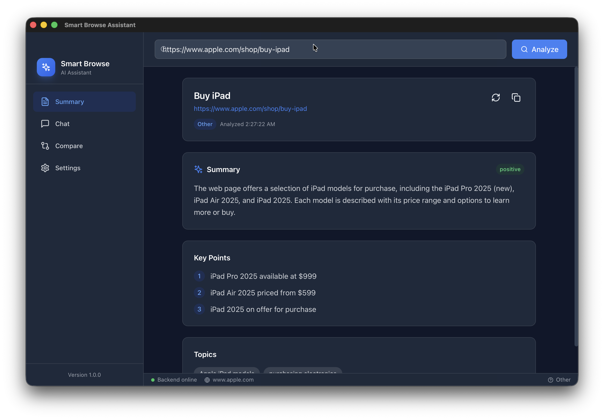
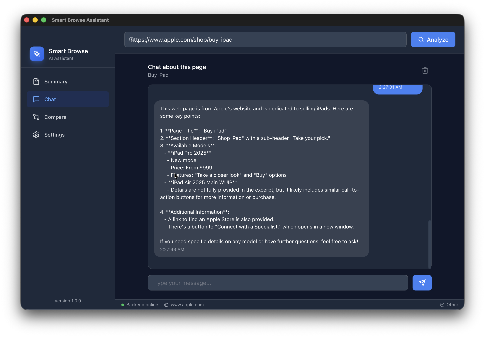
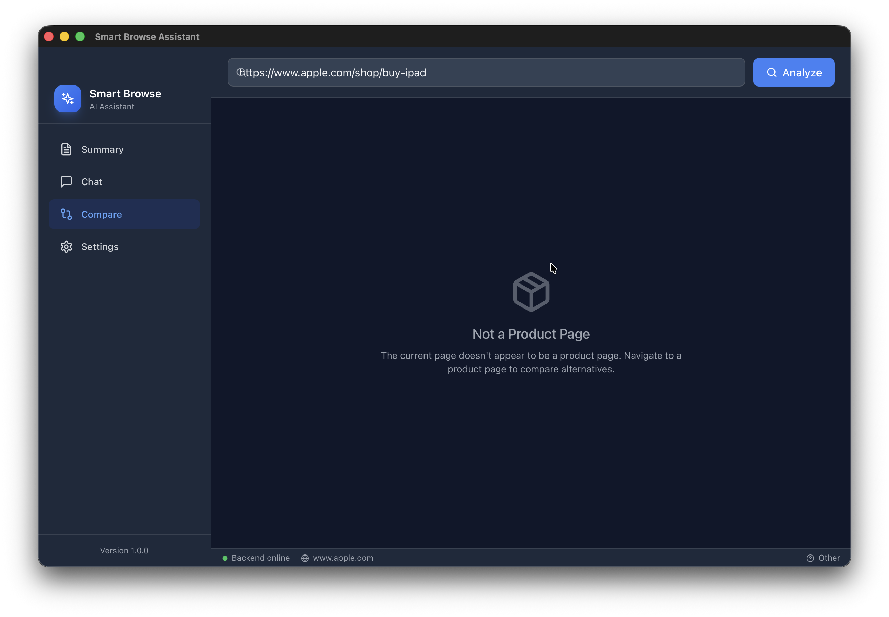
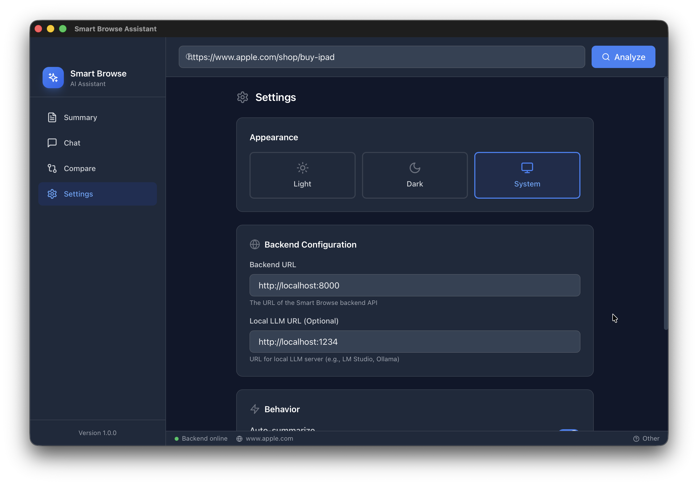
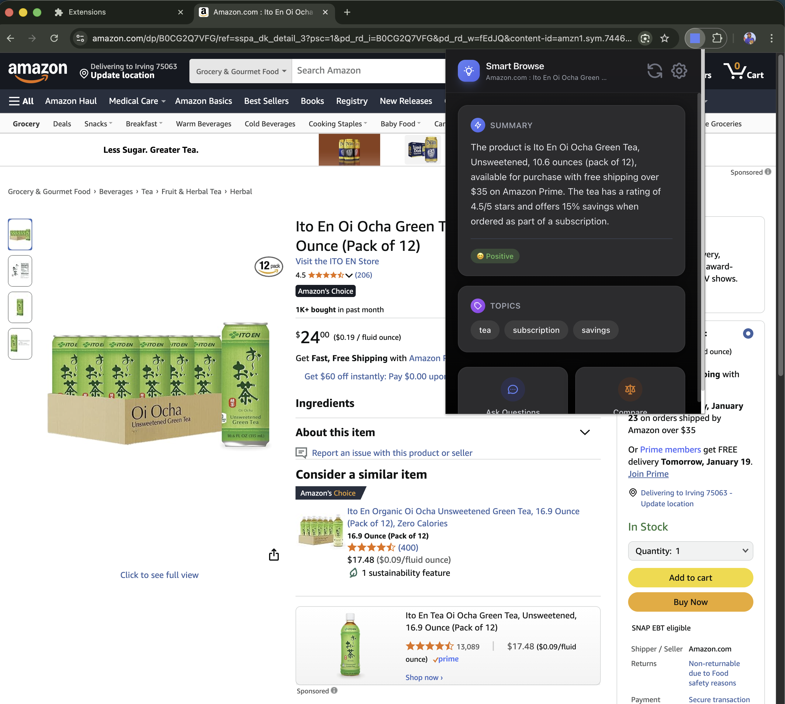

# 🧠 Smart Browse Assistant

> **AI-Powered Web Intelligence** — Transform any webpage into actionable insights using local LLMs

[](LICENSE)
[](https://python.org)
[](https://typescriptlang.org)
[](https://tauri.app)

---

## 📸 Application Demo

### 🖥️ Desktop Application (macOS/Windows)

<table>
<tr>
<td align="center">

<br/><b>📊 AI-Powered Summary</b>
<br/><sub>Extracts key points, sentiment, and topics from any webpage</sub>
</td>
<td align="center">

<br/><b>💬 Contextual Chat</b>
<br/><sub>Ask questions about the page content using natural language</sub>
</td>
</tr>
<tr>
<td align="center">

<br/><b>🔄 Product Comparison</b>
<br/><sub>Compare products and find alternatives across the web</sub>
</td>
<td align="center">

<br/><b>⚙️ Settings Configuration</b>
<br/><sub>Configure backend URL, theme, and behavior preferences</sub>
</td>
</tr>
</table>

### 🌐 Browser Extension (Chrome/Firefox/Safari)

<table>
<tr>
<td align="center">

<br/><b>📱 Quick Summary Popup</b>
<br/><sub>Instant page analysis with sentiment and topic extraction</sub>
</td>
<td align="center">

<br/><b>🤖 In-Page Chat Assistant</b>
<br/><sub>Chat with AI about any product or article while browsing</sub>
</td>
</tr>
</table>

---

## 🔄 How It Works

```
┌─────────────────────────────────────────────────────────────────────────────────────┐
│                                                                                      │
│   📥 INPUT                    🔄 PROCESSING                    📤 OUTPUT            │
│   ──────────                  ─────────────                    ──────────           │
│                                                                                      │
│   ┌──────────┐    ┌─────────────────────────────────────┐    ┌──────────────────┐   │
│   │          │    │                                     │    │                  │   │
│   │  🌐 URL  │───▶│  HTML Parser  ───▶  Content Extract │───▶│  📊 Summary      │   │
│   │          │    │                                     │    │  • Key Points    │   │
│   └──────────┘    │       ▼                             │    │  • Sentiment     │   │
│                   │                                     │    │  • Topics        │   │
│   ┌──────────┐    │  ┌─────────────┐   ┌────────────┐  │    └──────────────────┘   │
│   │          │    │  │             │   │            │  │                           │
│   │  ❓ Query │───▶│  │  PageContent│──▶│  🤖 Ollama │  │    ┌──────────────────┐   │
│   │          │    │  │  (JSON)     │   │  LLM       │  │───▶│  💬 Chat Reply   │   │
│   └──────────┘    │  │             │   │            │  │    │  Natural Language│   │
│                   │  └─────────────┘   └────────────┘  │    └──────────────────┘   │
│   ┌──────────┐    │                                     │                           │
│   │          │    │       ▼                             │    ┌──────────────────┐   │
│   │ 🛒 Product│───▶│  Product Extraction  ───▶  Compare │───▶│  🔄 Alternatives │   │
│   │          │    │                                     │    │  Pros/Cons       │   │
│   └──────────┘    └─────────────────────────────────────┘    └──────────────────┘   │
│                                                                                      │
└─────────────────────────────────────────────────────────────────────────────────────┘
```

---

## 🧠 LLM Processing Pipeline

```
                           ┌─────────────────────────────────────┐
                           │         USER INTERACTION            │
                           │   URL Input / Query / Chat Message  │
                           └───────────────┬─────────────────────┘
                                           │
                    ┌──────────────────────┼──────────────────────┐
                    │                      │                      │
                    ▼                      ▼                      ▼
           ┌───────────────┐      ┌───────────────┐      ┌───────────────┐
           │   SUMMARIZE   │      │     CHAT      │      │    COMPARE    │
           │   ──────────  │      │   ────────    │      │   ──────────  │
           │               │      │               │      │               │
           │ Extract key   │      │ Answer with   │      │ Find product  │
           │ information   │      │ page context  │      │ alternatives  │
           └───────┬───────┘      └───────┬───────┘      └───────┬───────┘
                   │                      │                      │
                   └──────────────────────┼──────────────────────┘
                                          │
                                          ▼
                           ┌─────────────────────────────────────┐
                           │           PROMPT BUILDER            │
                           │  ┌───────────────────────────────┐  │
                           │  │  System: "You are an AI..."   │  │
                           │  │  Context: {extracted_content} │  │
                           │  │  History: [past_messages]     │  │
                           │  │  Query: {user_question}       │  │
                           │  └───────────────────────────────┘  │
                           └───────────────┬─────────────────────┘
                                           │
                                           ▼
                           ┌─────────────────────────────────────┐
                           │         OLLAMA LOCAL LLM            │
                           │  ┌───────────────────────────────┐  │
                           │  │  Model: qwen2.5:7b            │  │
                           │  │  Temperature: 0.7             │  │
                           │  │  Max Tokens: 4096             │  │
                           │  │  Streaming: enabled           │  │
                           │  └───────────────────────────────┘  │
                           └───────────────┬─────────────────────┘
                                           │
                                           ▼
                           ┌─────────────────────────────────────┐
                           │          STRUCTURED OUTPUT          │
                           │  {                                  │
                           │    "summary": "...",                │
                           │    "key_points": ["...", "..."],    │
                           │    "sentiment": "positive",         │
                           │    "topics": ["AI", "tech"]         │
                           │  }                                  │
                           └─────────────────────────────────────┘
```

---

## 🏗️ System Architecture

```
┌──────────────────────────────────────────────────────────────────────────────────────┐
│                              SMART BROWSE ASSISTANT                                   │
├──────────────────────────────────────────────────────────────────────────────────────┤
│                                                                                       │
│   ┌─────────────────────────────────┐     ┌─────────────────────────────────────┐   │
│   │     🖥️ DESKTOP APP (Tauri)      │     │     🌐 BROWSER EXTENSION            │   │
│   │  ┌───────────────────────────┐  │     │  ┌───────────────────────────────┐  │   │
│   │  │  React + TypeScript       │  │     │  │  Popup UI (React)             │  │   │
│   │  │  ├── SummaryPanel         │  │     │  │  ├── Quick Summary            │  │   │
│   │  │  ├── ChatPanel            │  │     │  │  ├── Chat Interface           │  │   │
│   │  │  ├── ComparePanel         │  │     │  │  └── Settings                 │  │   │
│   │  │  └── SettingsPanel        │  │     │  └───────────────────────────────┘  │   │
│   │  └───────────────────────────┘  │     │                │                     │   │
│   │             │                   │     │                │                     │   │
│   │  ┌──────────▼────────────────┐  │     │  ┌─────────────▼─────────────────┐  │   │
│   │  │  Rust Backend (Tauri)     │  │     │  │  Content Script               │  │   │
│   │  │  ├── Web Scraper          │  │     │  │  └── DOM Extraction           │  │   │
│   │  │  └── API Client           │  │     │  └───────────────────────────────┘  │   │
│   │  └───────────────────────────┘  │     └─────────────────────────────────────┘   │
│   └─────────────────────────────────┘                       │                        │
│                      │                                      │                        │
│                      └──────────────────┬───────────────────┘                        │
│                                         │                                            │
│                                         ▼                                            │
│                      ┌─────────────────────────────────────────┐                     │
│                      │         🐍 PYTHON BACKEND (FastAPI)     │                     │
│                      │  ┌───────────────────────────────────┐  │                     │
│                      │  │  POST /api/summarize              │  │                     │
│                      │  │  POST /api/chat                   │  │                     │
│                      │  │  POST /api/compare                │  │                     │
│                      │  │  POST /api/analyze                │  │                     │
│                      │  └───────────────────────────────────┘  │                     │
│                      │                   │                     │                     │
│                      │  ┌────────────────▼──────────────────┐  │                     │
│                      │  │  LLM Service                      │  │                     │
│                      │  │  └── Prompt Engineering           │  │                     │
│                      │  └───────────────────────────────────┘  │                     │
│                      └───────────────────┬─────────────────────┘                     │
│                                          │                                           │
│                                          ▼                                           │
│                      ┌─────────────────────────────────────────┐                     │
│                      │           🦙 OLLAMA (Local LLM)         │                     │
│                      │  ┌───────────────────────────────────┐  │                     │
│                      │  │  qwen2.5:7b / llama3 / mistral    │  │                     │
│                      │  │  Endpoint: localhost:11434        │  │                     │
│                      │  └───────────────────────────────────┘  │                     │
│                      └─────────────────────────────────────────┘                     │
│                                                                                       │
└──────────────────────────────────────────────────────────────────────────────────────┘
```

---

## ✨ Key Features

| Feature | Desktop App | Browser Extension |
|---------|-------------|-------------------|
| 📊 **Page Summary** | ✅ Full summary with key points | ✅ Quick popup summary |
| 💬 **AI Chat** | ✅ Full conversation history | ✅ In-page chat overlay |
| 🔄 **Product Compare** | ✅ Detailed comparison | 🔜 Coming soon |
| ⚙️ **Settings** | ✅ Full configuration | ✅ Basic settings |
| 🌙 **Dark Mode** | ✅ System/Light/Dark | ✅ Follows system |
| 🦙 **Local LLM** | ✅ Ollama integration | ✅ Via backend |

---

## 📊 Data Flow Visualization

```
┌────────────────────────────────────────────────────────────────────────────────┐
│                              INPUT → PROCESS → OUTPUT                           │
├────────────────────────────────────────────────────────────────────────────────┤
│                                                                                 │
│  ┌─────────┐      ┌──────────────┐      ┌─────────────┐      ┌─────────────┐  │
│  │   URL   │ ───▶ │  Fetch HTML  │ ───▶ │   Parse     │ ───▶ │ PageContent │  │
│  └─────────┘      └──────────────┘      │   Extract   │      │    JSON     │  │
│                                         └─────────────┘      └──────┬──────┘  │
│                                                                     │         │
│                         ┌───────────────────────────────────────────┘         │
│                         │                                                      │
│                         ▼                                                      │
│  ┌──────────────────────────────────────────────────────────────────────────┐ │
│  │                        STRUCTURED PAGE CONTENT                            │ │
│  │  {                                                                        │ │
│  │    "url": "https://example.com/product",                                  │ │
│  │    "title": "Product Name",                                               │ │
│  │    "text": "Extracted page content...",                                   │ │
│  │    "page_type": "product",                                                │ │
│  │    "product": { "name": "...", "price": 99.99, "rating": 4.5 }           │ │
│  │  }                                                                        │ │
│  └──────────────────────────────────────────────────────────────────────────┘ │
│                         │                                                      │
│                         ▼                                                      │
│  ┌──────────────────────────────────────────────────────────────────────────┐ │
│  │                         LLM PROMPT COMPOSITION                            │ │
│  │  ┌────────────────────────────────────────────────────────────────────┐  │ │
│  │  │  SYSTEM: You are an AI assistant that analyzes web pages...        │  │ │
│  │  ├────────────────────────────────────────────────────────────────────┤  │ │
│  │  │  CONTEXT: {page_content}                                           │  │ │
│  │  ├────────────────────────────────────────────────────────────────────┤  │ │
│  │  │  USER: Summarize this page with key points and sentiment           │  │ │
│  │  └────────────────────────────────────────────────────────────────────┘  │ │
│  └──────────────────────────────────────────────────────────────────────────┘ │
│                         │                                                      │
│                         ▼                                                      │
│  ┌──────────────────────────────────────────────────────────────────────────┐ │
│  │                         STRUCTURED OUTPUT                                 │ │
│  │  {                                                                        │ │
│  │    "summary": "This product page showcases...",                           │ │
│  │    "key_points": [                                                        │ │
│  │      "Product available at $99.99",                                       │ │
│  │      "4.5 star rating from 200+ reviews",                                 │ │
│  │      "Free shipping available"                                            │ │
│  │    ],                                                                     │ │
│  │    "sentiment": "positive",                                               │ │
│  │    "topics": ["electronics", "shopping", "deals"]                         │ │
│  │  }                                                                        │ │
│  └──────────────────────────────────────────────────────────────────────────┘ │
│                                                                                 │
└────────────────────────────────────────────────────────────────────────────────┘
```

---

## 🚀 Quick Start

### Prerequisites

| Component | Version | Purpose |
|-----------|---------|---------|
| Node.js | 18+ | Frontend build |
| Python | 3.11+ | Backend API |
| Rust | 1.70+ | Desktop app |
| Ollama | latest | Local LLM inference |

### 1. Start Ollama

```bash
# Install Ollama (if not installed)
curl -fsSL https://ollama.ai/install.sh | sh

# Pull the model
ollama pull qwen2.5:7b

# Start Ollama server (runs on :11434)
ollama serve
```

### 2. Start Backend

```bash
cd backend
pip install -r requirements.txt
python -m uvicorn app.main:app --port 8000 --host 0.0.0.0
```

### 3. Run Desktop App

```bash
cd desktop
npm install
npm run tauri dev
```

---

## 🧪 API Reference

### POST `/api/summarize`

**Request:**
```json
{
  "content": {
    "url": "https://example.com",
    "title": "Page Title",
    "text": "Page content...",
    "page_type": "article"
  }
}
```

**Response:**
```json
{
  "success": true,
  "data": {
    "summary": "Concise summary of the page...",
    "key_points": ["Point 1", "Point 2", "Point 3"],
    "sentiment": "positive",
    "topics": ["technology", "AI"]
  }
}
```

### POST `/api/chat`

**Request:**
```json
{
  "messages": [
    {"id": "1", "role": "user", "content": "What is this about?", "timestamp": "..."}
  ],
  "context": {
    "url": "https://example.com",
    "title": "Page Title",
    "text": "Page content...",
    "page_type": "article"
  }
}
```

**Response:**
```json
{
  "success": true,
  "data": {
    "message": {
      "id": "uuid",
      "role": "assistant",
      "content": "This page discusses...",
      "timestamp": "2026-01-18T..."
    }
  }
}
```

---

## 🛠️ Tech Stack

| Layer | Technology | Purpose |
|-------|------------|---------|
| **Desktop** | Tauri 2.0 + Rust | Native app wrapper |
| **Frontend** | React 18 + TypeScript | UI components |
| **Styling** | TailwindCSS | Design system |
| **State** | Zustand | State management |
| **Backend** | FastAPI + Python | REST API |
| **Scraping** | reqwest + scraper | Content extraction |
| **LLM** | Ollama | Local inference |
| **Models** | qwen2.5:7b, llama3 | Language models |

---

## 📝 License

MIT License - See [LICENSE](LICENSE) for details.

---

<p align="center">
  <b>Built with ❤️ for researchers and developers who value privacy and local AI</b>
</p>